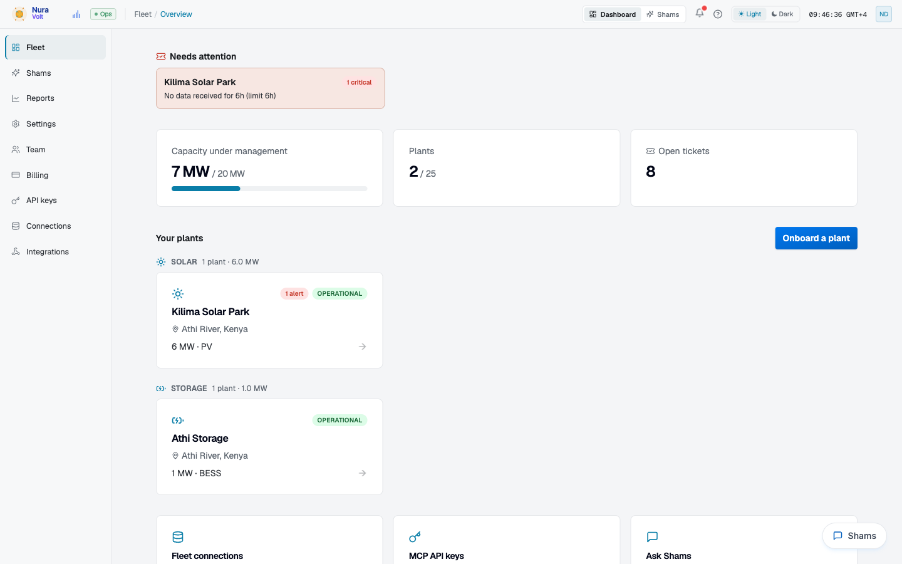
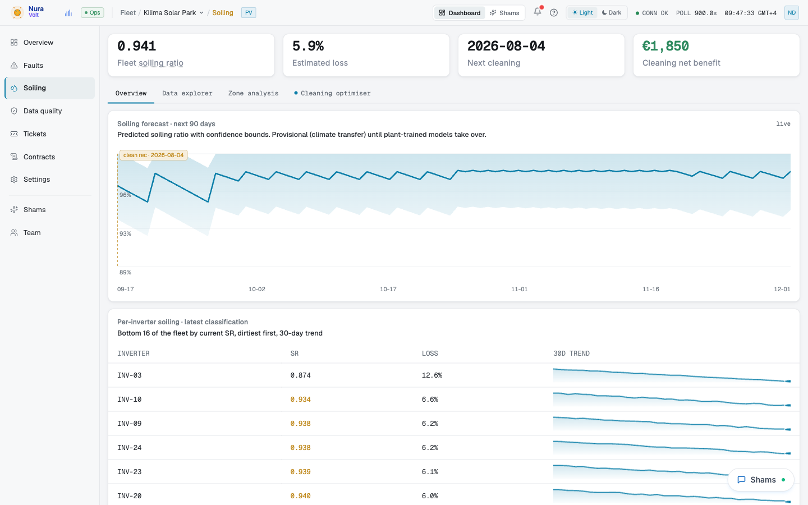
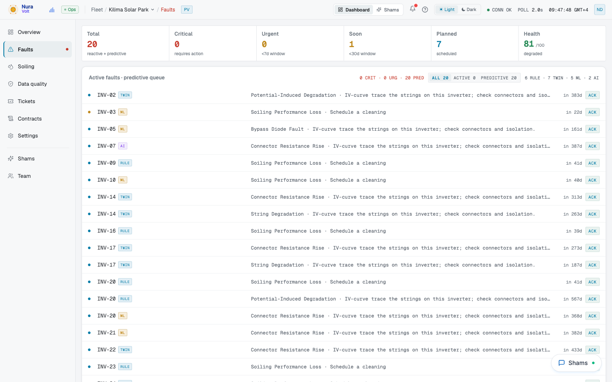
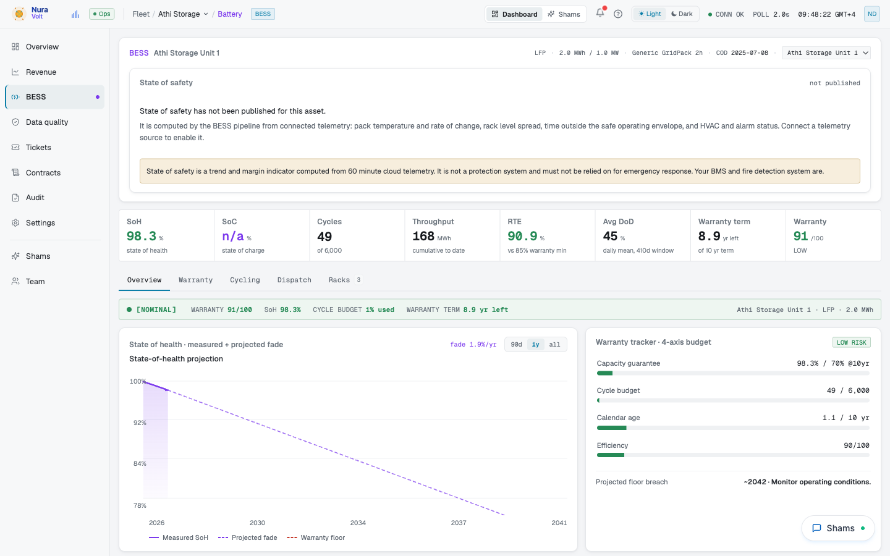
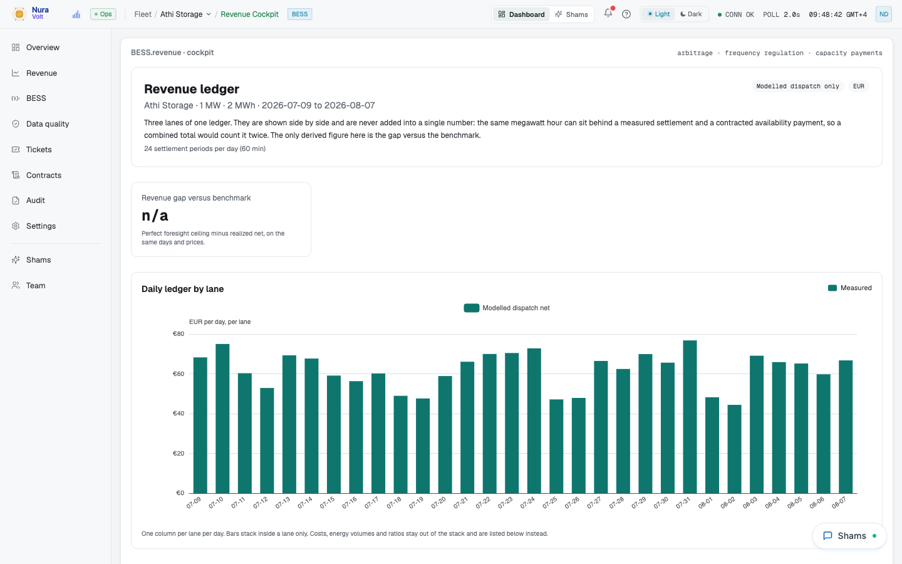
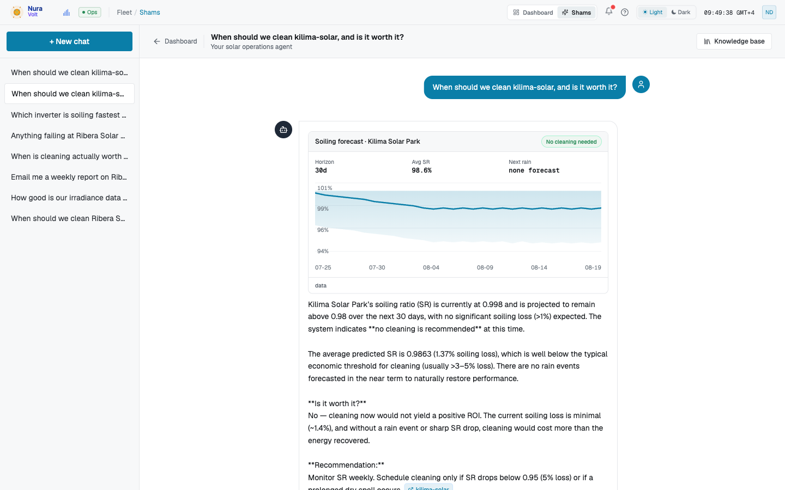
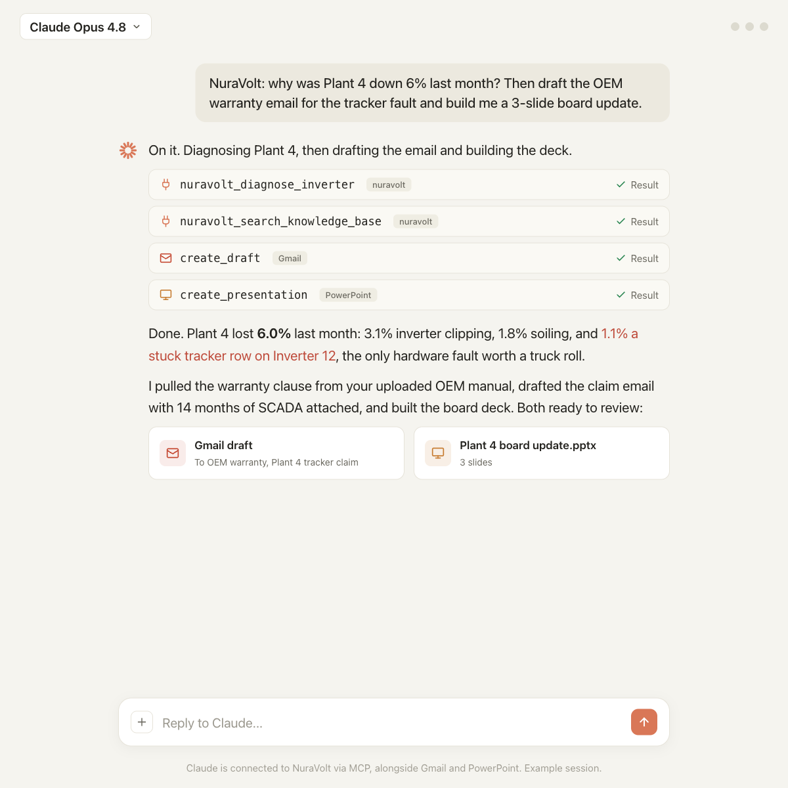
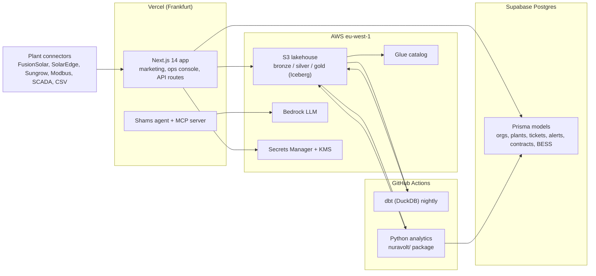

# NuraVolt

Energy intelligence for solar, wind and battery storage: a production SaaS that turns raw plant telemetry into per-inverter soiling forecasts, fault and remaining-life predictions, battery warranty and revenue tracking, and an operations agent that can act on all of it.

Built and operated as a solo product from 2025 to 2026. The live platform runs at [nuravolt.com](https://nuravolt.com). This repository is the full source: the Next.js application, the Python analytics package, the lakehouse pipeline, the tests and the documentation.



## What it does

**Per-inverter soiling intelligence.** Plants usually carry one dust sensor for the whole site. NuraVolt infers a soiling ratio for every inverter from AC power, irradiance and cell temperature after digital-twin correction for weather, curtailment and temperature, then forecasts it 365 days out with a physics-ML hybrid (LightGBM over pvlib clear-sky features) and optimises the cleaning schedule against energy price, rain forecast and cleaning cost.



**Fault detection and remaining useful life.** Rule-based, twin-residual and ML detectors run side by side over inverter, string and MPPT telemetry. Each fault carries an evidence chain, a confidence and a time-to-action, and thermal RUL models rank inverters by degradation.



**Battery intelligence.** Rainflow cycle counting, chemistry-aware degradation, a four-axis warranty tracker and a worst-of-four state of safety. Revenue is kept as a three-lane ledger (measured, declared, benchmark) that is never summed, with a perfect-foresight arbitrage bound over real day-ahead prices from Elexon, NESO, OMIE and ENTSO-E.




**Shams, the operations agent.** A tool-using LLM agent (AWS Bedrock) with 15 typed tools over the same services the UI uses: forecasts, fault triage, cleaning optimisation, contract obligations, report composition, ticket drafts. Every tool result renders as a rich card, and the same tools are exposed to external agents through an MCP server with OAuth and scoped API keys.




**Also in the box:** digital twins per plant and per device (physics plus CatBoost residual), contract intelligence (PPA, warranty, SLA obligations evaluated hourly), alert evaluation with email and signed webhooks, a ticketing workflow, scheduled PDF reports rendered with headless Chromium, a data hub with lineage, multi-tenant organisations with plan gating and Stripe billing, and connectors for Huawei FusionSolar, SolarEdge, Sungrow, Modbus, SCADA databases and CSV.

## Architecture



The full topology, every data plane and the honest state of each is in [docs/ARCHITECTURE.md](docs/ARCHITECTURE.md).

## Tech stack

| Layer | Choice |
|---|---|
| Web | Next.js 14 (App Router), React 18, TypeScript, Tailwind, shadcn/ui, ECharts |
| Auth and tenancy | Better Auth (email, Google, magic link, organisations), MCP OAuth provider |
| Ops database | PostgreSQL on Supabase via Prisma |
| Analytics lake | Apache Iceberg on S3, AWS Glue catalog, DuckDB compute, dbt silver and gold models |
| Analytics | Python 3.11: Polars, pandas, pvlib, LightGBM, CatBoost, scikit-learn |
| LLM | AWS Bedrock (Qwen), typed tool calling, cost tracking per turn |
| Billing | Stripe |
| Hosting and batch | Vercel, GitHub Actions |
| Tests | Vitest (API contracts, tenancy, UI logic), pytest (analytics), Playwright (page walk) |

## Repository layout

```
src/                 Next.js app: app router pages, API routes, components, lib
  app/api/           REST routes (soiling, faults, bess, tickets, contracts, chat, mcp, cron)
  lib/               services, agent tools, MCP server, alerts, contracts, billing
nuravolt/            Python analytics package
  soiling/           soiling ratio, per-inverter estimation, forecasting, cleaning optimiser
  fault/             rule-based detection, thermal RUL, topology
  digitaltwin/       physics + ML hybrid twins
  bess/              rainflow, degradation, warranty, optimizer audit, imbalance
  markets/           day-ahead prices (GB, Iberia, ENTSO-E)
  lake/              Iceberg lakehouse access and publish seam
  pipeline/          orchestration entry points
dbt_project/         silver and gold models over the bronze lake
prisma/              schema, migrations, seeds
public/data/         static forecast and twin artifacts read by the demo pages
scripts/             analysis, training, backfill and QA scripts (see scripts/README.md)
tests/               vitest and pytest suites
automation/qa/       end-to-end validation harness
docs/                architecture hub, model docs, technical specs
```

## Running it locally

Prerequisites: Node 22, Python 3.11, PostgreSQL (a Supabase project or local instance).

```bash
cp .env.example .env.local        # fill in DATABASE_URL, BETTER_AUTH_SECRET and any provider keys
npm install
npx prisma migrate deploy
npm run seed                      # demo organisation, plants and tickets
npm run dev                       # http://localhost:3000
```

Python analytics:

```bash
pip install -e ".[lake,dev]"
python scripts/generate_per_inverter_soiling.py --help   # per-inverter soiling artifacts
python scripts/run_fault_detection.py --help             # rule + twin + ML fault pass
```

## Tests

```bash
npm test               # vitest: API contracts, tenancy isolation, connectors, UI logic
npm run test:py:ci     # pytest: soiling, fault, BESS, twin, markets, lake
npm run lint
npm run validate       # full harness: leak lint, API sweep, contracts, Playwright page walk
```

CI runs lint, both test suites and a production build on every push ([.github/workflows/ci.yml](.github/workflows/ci.yml)).

## Documentation

- [Architecture hub](docs/ARCHITECTURE.md): topology, data planes, lakehouse layers, ingestion contracts
- [Project map](docs/PROJECT_MAP.md): every model, every LLM call site, public datasets, foundation models
- [Data architecture](docs/DATA_ARCHITECTURE_GUIDE.md): lakehouse decision record and as-built
- [Model accuracy](docs/MODEL_ACCURACY.md) and [methods](docs/MODEL_ACCURACY_METHODS.md): what the models are measured against
- [Product overviews](docs/overviews/): soiling, fault detection, inverter health, battery, digital twin, forecasting
- [Technical specs](docs/technical/): soiling methodology, fault detection spec, twin configuration, transfer learning
- [MCP server](docs/MCP_SERVER.md), [AI and LLM usage](docs/AI_AND_LLM_USAGE.md), [cloud inverter APIs](docs/CLOUD_INVERTER_APIS.md)

## A note on the data

Plant names, locations and identifiers in this repository are fictional or anonymised. Measured telemetry that trained and validated the models came from operating plants under agreements that do not permit redistribution, so the fixtures here are anonymised specimens or synthetic series. Every number the UI shows is tagged with its provenance (measured, modelled, provisional) and the product never presents a modelled value as a measurement.
