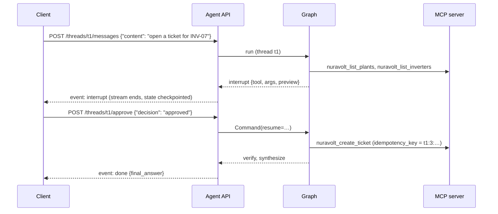

# The agent service

`nuravolt/agent` is a planner/executor agent built on LangGraph (Python 3.11 or newer). It runs as a separate Python service next to the web app and consumes the product the same way an external integrator would: through the public MCP server, with an API key, scope checks, rate limits and an audit trail on the server side.

It exists alongside the in-app chat (Shams) on purpose. Shams is a single `streamText` loop: the model picks from 28 tools, up to eight steps, and the UI renders draft cards for writes. That is the right shape for an interactive copilot. The service is the shape you want when an agent has to be trusted with actions: an explicit graph with a plan, a verifier that reads every tool result, a durable pause before any write, and memory that survives the process.

## Architecture

```mermaid
flowchart LR
  client["CLI / HTTP client"] -->|SSE| api["FastAPI<br/>nuravolt.agent.server"]
  api --> graph["LangGraph graph"]
  graph -->|tool calls| mcp["NuraVolt MCP server<br/>/api/mcp/mcp"]
  mcp --> app["Next.js app<br/>plants, soiling, faults, BESS, tickets"]
  graph -->|checkpoints + memory| pg[("Postgres<br/>schema agent")]
  graph -->|usage rows| llm[("LLMInteraction")]
  graph --> model["Bedrock (Qwen)<br/>or any OpenAI-compatible endpoint"]
```

## The graph

```mermaid
stateDiagram-v2
    [*] --> memory_read
    memory_read --> classify_intent
    classify_intent --> synthesize : chitchat / out_of_scope
    classify_intent --> plan : question / action
    plan --> dispatch : has steps
    plan --> synthesize : empty plan
    dispatch --> request_approval : write step, not yet approved
    dispatch --> execute_step
    request_approval --> execute_step : approved / edited
    request_approval --> verify : rejected (step skipped)
    execute_step --> verify
    verify --> dispatch : continue / retry
    verify --> plan : replan (max 2)
    verify --> synthesize : finish / plan done
    synthesize --> memory_write
    memory_write --> [*]
```



| Node | Model call | What it does |
|---|---|---|
| `memory_read` | none | Loads up to 8 durable facts for the organisation from the store and puts them in state. |
| `classify_intent` | structured `IntentOut` | question, action, chitchat or out of scope. Small talk and off-topic requests never reach the tools. |
| `plan` | structured `PlanOut` | Produces ordered steps against the tool catalogue. The graph, not the model, marks which steps are writes, drops steps that name tools that do not exist, and allows one write per request. |
| `dispatch` | none | Routes the current step to approval or execution. |
| `request_approval` | none | LangGraph `interrupt()` with a human-readable preview of the write. The decision (approved, edited, rejected) arrives later through `Command(resume=…)`. |
| `execute_step` | structured `ArgsOut` only when needed | Binds arguments the planner left open (ids that come from earlier results) from the thread's tool results, validates them against the tool's JSON schema, injects an idempotency key for writes, calls the tool over MCP. Refuses to run a write whose step is not approved. |
| `verify` | structured `VerdictOut` | Reads the goal and the result and decides: continue, retry the step, replan, or finish early. |
| `synthesize` | text | Writes the answer from tool results, approvals and verdicts only. A rejected write is reported as not done. |
| `memory_write` | structured `MemoryFactsOut` | Extracts durable facts from the user's message and upserts them under stable keys. |

Guard rails: `AGENT_MAX_STEPS` (8), at most two replans, a recursion limit on the graph, a 60 s timeout per tool call, and the option of minting the agent's API key with read-only scopes so writes are impossible at the server regardless of what the graph does.

## Human in the loop

Writes (`nuravolt_create_ticket`, `nuravolt_update_ticket_status`, `nuravolt_comment_on_ticket`, `nuravolt_schedule_report`, `nuravolt_approve_cleaning_schedule`) are listed in `tools/mcp_client.py` as a hard-coded set. If the server ever advertises a tool that looks like a write and is not in that set, the service refuses to start.



The interrupt is stored in the Postgres checkpoint, so the approval can come from another process minutes later, and a restarted service resumes the same thread. The idempotency key is derived from the thread, step and arguments, so a retried or double-submitted approval cannot create two tickets.

## Memory

Two kinds, both in Postgres schema `agent` (LangGraph manages it; Prisma never sees it):

- **Checkpoints**: every node transition of every thread. `GET /threads/{id}/history` lists them, which is also how you inspect a run after the fact.
- **Long-term facts**: a store namespace per organisation (`("org", org_id, "facts")`). Facts are extracted with a structured call after each answer, kept only above 0.6 confidence, and keyed `kind:subject` so "call kilima-solar the big one" updates the same row next time instead of adding a duplicate.

Without a `DATABASE_URL` both fall back to in-memory implementations, which is what the tests and `--ephemeral` CLI runs use.

## Model providers

`models.get_chat_model()` picks, in order: a fake model (tests), AWS Bedrock via `langchain-aws` when credentials exist, otherwise any OpenAI-compatible endpoint via `OPENAI_BASE_URL` (Ollama on a laptop works). All model calls go through `call_structured()`, which validates the reply against a pydantic schema and re-prompts once with the validation error, and a retry policy with jitter for throttling. Token usage is recorded per call into the product's `LLMInteraction` table with `request_hash = agent:<node>:<thread>` so `/admin/usage` can break cost down by node.

## Evals

`nuravolt/agent/evals/cases.yaml` holds scripted cases: the prompt, the plan the model is scripted to produce, canned tool outputs, and assertions about what the graph must do (ordered tool trajectory, tools that must never run, whether an approval interrupt fired, what happened after approve, reject or edit, replans, memory writes). `tests/agent` runs every case through the real graph with `ScriptedChatModel` and fake tools that carry the real MCP names and schemas, so CI needs no keys.

```bash
pip install -e ".[agent]"
pytest -q tests/agent
python -m nuravolt.agent eval
```

`scripts/agent_eval_live.py` reruns the same prompts against a real model and the real MCP server, checks the trajectory as a subset, and grades the answer with an LLM judge.

## Running it

```bash
# against a running app (npm run dev) with a key minted by the demo seeder
export MCP_URL=http://localhost:3000/api/mcp/mcp MCP_API_KEY=nv_test_...
python -m nuravolt.agent tools                     # catalogue from the server
python -m nuravolt.agent chat --thread t1 "Which inverter at Kilima is soiling fastest?"
python -m nuravolt.agent serve                     # FastAPI on :8100

# HTTP
curl -N -H "Authorization: Bearer $AGENT_SERVICE_TOKEN" -H 'Content-Type: application/json' \
  -d '{"content":"Open a HIGH ticket on Kilima INV-07 for a string fault"}' \
  http://localhost:8100/threads/t1/messages
curl -N -H "Authorization: Bearer $AGENT_SERVICE_TOKEN" -H 'Content-Type: application/json' \
  -d '{"decision":"approved"}' http://localhost:8100/threads/t1/approve
curl -H "Authorization: Bearer $AGENT_SERVICE_TOKEN" http://localhost:8100/threads/t1/state
```

`docker compose up` starts the service as `agent`, pointed at the `web` container's MCP endpoint with the key the demo seeder writes into a shared volume.

| Variable | Purpose |
|---|---|
| `MCP_URL`, `MCP_API_KEY` | The product's MCP endpoint and an API key (`/dashboard/settings/api-keys` or the demo seeder). |
| `DATABASE_URL` | Postgres for checkpoints, memory and usage rows. Optional for the CLI. |
| `AGENT_ORG_ID` | Organisation the service acts for. |
| `AGENT_SERVICE_TOKEN` | Bearer token clients must send to the HTTP API. |
| `AWS_BEARER_TOKEN_BEDROCK` / `AWS_ACCESS_KEY_ID`, `AWS_REGION`, `BEDROCK_MODEL_ID` | Bedrock provider. |
| `OPENAI_BASE_URL`, `OPENAI_API_KEY`, `OPENAI_MODEL` | Any OpenAI-compatible provider. |
| `LANGSMITH_TRACING`, `LANGSMITH_API_KEY` | Optional tracing. |
| `AGENT_MAX_STEPS`, `AGENT_MAX_REPLANS`, `AGENT_RECURSION_LIMIT` | Loop guards. |

## How it differs from the in-app chat

| | Shams (in app) | Agent service |
|---|---|---|
| Orchestration | One `streamText` loop, model picks tools | Explicit graph: classify, plan, execute, verify, synthesize |
| Writes | Draft cards, confirmed by a click in the UI | `interrupt()` in the graph, resumed by an API call; idempotent |
| State | Message replay from the browser | Postgres checkpoints per thread, resumable after restart |
| Memory | None beyond the transcript | Per-organisation facts store |
| Tools | In-process zod tools | The product's own MCP surface, scoped API key |
| Time budget | Vercel function limit | None; guarded by step, replan and recursion limits |
| Evals | Fixture recomputation tests | Trajectory and approval evals in CI, live judge script |
